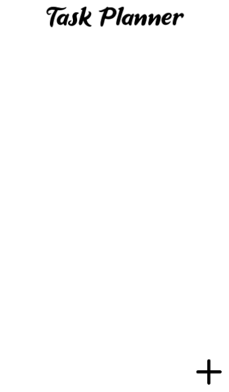
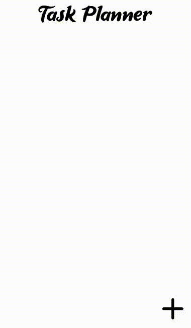

# TaskPlanner
Проект TaskPlanner создан для удобного управления личным временем, организации списков дел и контроля дедлайнов с помощью встроенных уведомлений.

# Функционал

Функции разделены на пользовательские и архитектурные.

* **В приложении можно быстро создавать, редактировать и удалять задачи.**

* **Есть гибкая система напоминаний — можно выбрать таймер из стандартных вариантов (1, 5, 10 минут) или задать своё время через настраиваемый список.**

* **Навигация сделана простой: можно листать список задач и быстро переключаться между главным экраном и редактором задач.**

# Особенности архитектуры:

* **Приложение работает без подключения к интернету — все данные хранятся локально в формате JSON, что обеспечивает быстрый доступ к задачам.**

* **Поддерживается работа на Windows, macOS и Linux благодаря аппаратному ускорению через OpenGL и фреймворку Kivy. В будущем планируется порт на м*обильные устройства.**

* **Интерфейс работает асинхронно — таймеры напоминаний не блокируют работу приложения, оно не зависает в ожидании времени.**

# Технологии:

Выбран стек Python, так как он позволяет быстро разрабатывать кроссплатформенные приложения.

* **Python 3.x выбран за удобство и богатый набор библиотек, это облегчает поддержку и добавление новых функций.**

* **Для интерфейса использован Kivy, который поддерживает GPU-ускорение и позволяет выпускать программы под разные ОС без переработки логики.**

* **Plyer отвечает за кроссплатформенные уведомления, заменяя необходимость писать код под каждую систему отдельно.**

# Дополнительные модули:

* **json — для хранения данных в удобном формате без необходимости использовать базы данных.**

* **os — чтобы правильно работать с путями и находить файл с задачами вне зависимости от среды запуска.**

* **threading — позволяет запускать таймеры в отдельном потоке, не загружая основную программу, которая занимается отрисовкой интерфейса.**

* **time — помогает контролировать точность работы напоминаний через задержки в потоках.**

# Интерфейс:

## Главный экран и экран редактирования.

## Демострация функций
[

# Для установки:

Склонируйте репозиторий, перейдите в папку проекта, установите зависимости и запустите программу:

* **git clone https://github.com/muyewerty/TaskPlanner.git**

* **cd TaskPlanner**

* **pip install -r requirements.txt**

* **python main.py**
